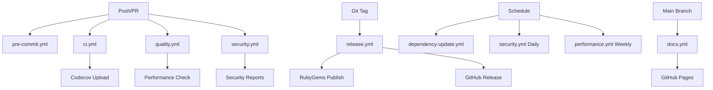

# GitHub Workflows

This directory contains the GitHub Actions workflows for the Prescient gem.

## Workflows Overview

### 🚀 [ci.yml](./ci.yml) - Continuous Integration

**Triggers**: Push/PR to main/develop branches

- Tests across multiple Ruby versions (3.1, 3.2, 3.3, 3.4)
- Linting with RuboCop
- Security scanning with Bundler Audit and Brakeman
- Gem building and artifact upload
- Code coverage reporting to Codecov

### ⚡ [pre-commit.yml](./pre-commit.yml) - Fast Pre-commit Checks

**Triggers**: Pull request events

- RuboCop on changed files only
- Focused testing on modified code
- Commit message format validation
- Debugging code detection
- File size limit warnings
- Quick security scans

### 🔒 [security.yml](./security.yml) - Security Monitoring

**Triggers**: Push/PR + Daily schedule (2 AM UTC)

- Dependency vulnerability scanning
- Static security analysis with Brakeman
- Secret scanning with TruffleHog
- Automated security report generation

### 📊 [quality.yml](./quality.yml) - Code Quality

**Triggers**: Push/PR to main/develop branches

- Full RuboCop analysis with reporting
- Code coverage validation (85% threshold)
- YARD documentation generation and coverage
- Performance benchmarking
- Memory usage analysis

### 📚 [docs.yml](./docs.yml) - Documentation

**Triggers**: Push to main + PR with doc changes

- YARD API documentation generation
- Documentation link validation
- Coverage badge generation
- GitHub Pages deployment
- Documentation artifact management

### 🏷️ [release.yml](./release.yml) - Release Automation

**Triggers**: Git tags (v\*)

- Multi-version testing before release
- Version consistency validation
- Automated gem building and publishing to RubyGems
- GitHub Release creation with artifacts
- CHANGELOG.md updates

### 🔄 [dependency-update.yml](./dependency-update.yml) - Dependency Management

**Triggers**: Weekly schedule (Monday 9 AM UTC) + Manual

- Automated dependency updates
- Test execution with updated dependencies
- Pull request creation for updates
- Security vulnerability monitoring
- Automated issue creation for security problems

### ⚡ [performance.yml](./performance.yml) - Performance Monitoring

**Triggers**: Push to main + PR + Weekly schedule (Sunday 6 AM UTC)

- Comprehensive benchmarking with benchmark-ips
- Memory usage analysis and leak detection
- Performance regression detection
- Ruby profiling (weekly)
- Performance baseline maintenance

## Workflow Dependencies



## Required Secrets

Configure these secrets in your GitHub repository settings:

### Required for Release

- `RUBYGEMS_API_KEY` - Your RubyGems API key for publishing

### Optional for Enhanced Features

- `CODECOV_TOKEN` - For enhanced Codecov integration
- `GITHUB_TOKEN` - Automatically provided by GitHub Actions

## Badge Integration

Add these badges to your README.md:

```markdown
[](https://github.com/yourcompany/prescient/actions/workflows/ci.yml)
[](https://github.com/yourcompany/prescient/actions/workflows/security.yml)
[](https://github.com/yourcompany/prescient/actions/workflows/quality.yml)
[](https://codecov.io/gh/yourcompany/prescient)
```

## Workflow Customization

### Adjusting Ruby Versions

Edit the matrix in `ci.yml` and `release.yml`:

```yaml
matrix:
  ruby-version: ["3.1", "3.2", "3.3", "3.4"]
```

### Coverage Threshold

Modify the threshold in `quality.yml`:

```bash
if (( $(echo "$COVERAGE < 85" | bc -l) )); then
```

### Performance Thresholds

Adjust limits in `performance.yml`:

```ruby
if overhead > 50  # 50% overhead threshold
```

### Schedule Adjustments

Modify cron expressions:

```yaml
schedule:
  - cron: "0 2 * * *" # Daily at 2 AM UTC
  - cron: "0 9 * * 1" # Weekly on Monday at 9 AM UTC
```

## Troubleshooting

### Common Issues

1. **RuboCop Failures**: Check `.rubocop.yml` configuration
2. **Test Failures**: Ensure all dependencies are properly specified
3. **Security Scan False Positives**: Update `.github/workflows/security.yml` filters
4. **Performance Regression**: Check recent changes for performance impact
5. **Release Failures**: Verify version consistency between tag and `lib/prescient/version.rb`

### Debug Mode

Add to any workflow for debugging:

```yaml
- name: Debug
  run: |
    echo "Debug information"
    env
    ls -la
```

## Maintenance

- **Monthly**: Review and update Ruby versions in CI matrix
- **Quarterly**: Update GitHub Actions versions (@v4, @v3, etc.)
- **As needed**: Adjust performance thresholds based on application growth
- **Security updates**: Monitor and update security scanning tools
